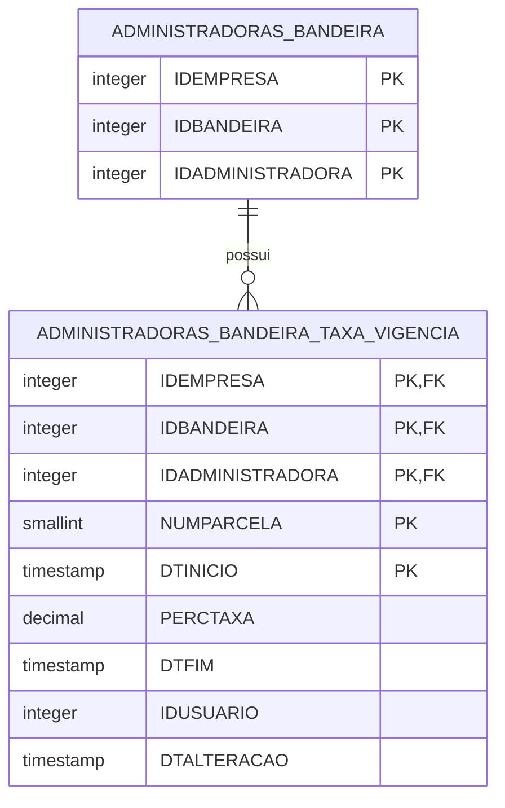

# Taxas de administradoras por parcela e vigencia

## Objetivo

Registrar a taxa aplicada por parcela para cada administradora/bandeira com periodo de vigencia, permitindo reprocessamento historico pela data original da transacao.

## Modelo proposto



## Regra de vigencia

- Cada registro representa a taxa de uma faixa de parcelas em um intervalo de vigencia.
- `NUMPARCELA` representa o limite superior da faixa, ou seja, "parcela ate".
- Para localizar a taxa de uma parcela, buscar o menor `NUMPARCELA` vigente que seja maior ou igual a parcela informada.
- `DTINICIO` e inclusivo.
- `DTFIM` e exclusivo. Quando estiver nulo, a taxa esta vigente indefinidamente.
- Para buscar a taxa historica, usar a data da transacao/reprocessamento:

```sql
SELECT
    TXV.PERCTAXA
FROM
    DBA.ADMINISTRADORAS_BANDEIRA_TAXA_VIGENCIA TXV
WHERE
    TXV.IDEMPRESA = :IDEMPRESA AND
    TXV.IDBANDEIRA = :IDBANDEIRA AND
    TXV.IDADMINISTRADORA = :IDADMINISTRADORA AND
    TXV.NUMPARCELA >= :NUMPARCELA AND
    :DTMOVIMENTO >= TXV.DTINICIO AND
    (
        TXV.DTFIM IS NULL OR
        :DTMOVIMENTO < TXV.DTFIM
    )
ORDER BY
    TXV.NUMPARCELA,
    TXV.DTINICIO DESC
FETCH FIRST 1 ROW ONLY
```

Exemplo de faixas:

| NUMPARCELA cadastrado | Abrangencia | Taxa |
| --- | --- | --- |
| 3 | parcelas 1 ate 3 | 2,000000 |
| 5 | parcelas 4 ate 5 | 2,500000 |
| 7 | parcelas 6 ate 7 | 3,000000 |
| 10 | parcelas 8 ate 10 | 3,500000 |

## Criacao da tabela

> Observacao: a conexao com a base `PRIVADO` foi localizada e testada ate a etapa de autenticacao, mas a senha nao esta salva no workspace. Por isso, nao foi possivel consultar o catalogo diretamente. A proposta abaixo usa a estrutura informada da tabela real `ADMINISTRADORAS_BANDEIRA`, cuja PK e composta por `IDEMPRESA`, `IDBANDEIRA` e `IDADMINISTRADORA`.
>
> A tabela `ADMINISTRADORAS_BANDEIRA_TAXAS` fica fora deste novo desenho porque a regra de unicidade por parcela/taxa impede que ela represente corretamente uma linha do tempo historica. Ela pode permanecer para compatibilidade com rotinas antigas, mas o reprocessamento historico deve consultar a nova tabela de vigencia.

```sql
CREATE TABLE DBA.ADMINISTRADORAS_BANDEIRA_TAXA_VIGENCIA (
    IDEMPRESA        INTEGER       NOT NULL,
    IDBANDEIRA       INTEGER       NOT NULL,
    IDADMINISTRADORA INTEGER       NOT NULL,
    NUMPARCELA       SMALLINT      NOT NULL,
    DTINICIO         TIMESTAMP     NOT NULL,
    PERCTAXA         DECIMAL(12,6) NOT NULL,
    DTFIM            TIMESTAMP,
    IDUSUARIO        INTEGER       NOT NULL,
    DTALTERACAO      TIMESTAMP     NOT NULL DEFAULT CURRENT_TIMESTAMP
)
GO

ALTER TABLE DBA.ADMINISTRADORAS_BANDEIRA_TAXA_VIGENCIA ADD CONSTRAINT PK_ADMINBANDTAXAVIG PRIMARY KEY (IDEMPRESA, IDBANDEIRA, IDADMINISTRADORA, NUMPARCELA, DTINICIO)
GO

ALTER TABLE DBA.ADMINISTRADORAS_BANDEIRA_TAXA_VIGENCIA ADD CONSTRAINT FK_ADMINBANDTAXAVIG_BANDEIRA FOREIGN KEY (IDEMPRESA, IDBANDEIRA, IDADMINISTRADORA) REFERENCES DBA.ADMINISTRADORAS_BANDEIRA (IDEMPRESA, IDBANDEIRA, IDADMINISTRADORA)
GO

ALTER TABLE DBA.ADMINISTRADORAS_BANDEIRA_TAXA_VIGENCIA ADD CONSTRAINT FK_ADMINBANDTAXAVIG_USUARIO FOREIGN KEY (IDUSUARIO) REFERENCES DBA.USUARIO (IDUSUARIO)
GO

ALTER TABLE DBA.ADMINISTRADORAS_BANDEIRA_TAXA_VIGENCIA ADD CONSTRAINT CKT_ADMINBANDTAXAVIG_PARCELA CHECK (NUMPARCELA > 0)
GO

ALTER TABLE DBA.ADMINISTRADORAS_BANDEIRA_TAXA_VIGENCIA ADD CONSTRAINT CKT_ADMINBANDTAXAVIG_TAXA CHECK (PERCTAXA >= 0)
GO

ALTER TABLE DBA.ADMINISTRADORAS_BANDEIRA_TAXA_VIGENCIA ADD CONSTRAINT CKT_ADMINBANDTAXAVIG_PERIODO CHECK (DTFIM IS NULL OR DTFIM > DTINICIO)
GO

CREATE INDEX DBA.IX_ADMINBANDTAXAVIG_CONSULTA
    ON DBA.ADMINISTRADORAS_BANDEIRA_TAXA_VIGENCIA (IDEMPRESA, IDBANDEIRA, IDADMINISTRADORA, NUMPARCELA, DTINICIO, DTFIM)
GO

COMMENT ON TABLE DBA.ADMINISTRADORAS_BANDEIRA_TAXA_VIGENCIA IS 'Historico de taxas por parcela da administradora/bandeira com periodo de vigencia.'
GO

COMMENT ON COLUMN DBA.ADMINISTRADORAS_BANDEIRA_TAXA_VIGENCIA.IDEMPRESA IS 'Codigo da empresa da administradora/bandeira.'
GO

COMMENT ON COLUMN DBA.ADMINISTRADORAS_BANDEIRA_TAXA_VIGENCIA.IDBANDEIRA IS 'Codigo da bandeira vinculada a administradora.'
GO

COMMENT ON COLUMN DBA.ADMINISTRADORAS_BANDEIRA_TAXA_VIGENCIA.IDADMINISTRADORA IS 'Codigo da administradora vinculada a bandeira.'
GO

COMMENT ON COLUMN DBA.ADMINISTRADORAS_BANDEIRA_TAXA_VIGENCIA.NUMPARCELA IS 'Limite superior da faixa de parcelas para aplicacao da taxa.'
GO

COMMENT ON COLUMN DBA.ADMINISTRADORAS_BANDEIRA_TAXA_VIGENCIA.PERCTAXA IS 'Percentual da taxa aplicada para a parcela no periodo de vigencia.'
GO

COMMENT ON COLUMN DBA.ADMINISTRADORAS_BANDEIRA_TAXA_VIGENCIA.DTINICIO IS 'Data e hora inicial de vigencia da taxa.'
GO

COMMENT ON COLUMN DBA.ADMINISTRADORAS_BANDEIRA_TAXA_VIGENCIA.DTFIM IS 'Data e hora final exclusiva de vigencia da taxa. Nulo indica vigencia aberta.'
GO

COMMENT ON COLUMN DBA.ADMINISTRADORAS_BANDEIRA_TAXA_VIGENCIA.IDUSUARIO IS 'Usuario responsavel pela manutencao do registro.'
GO

COMMENT ON COLUMN DBA.ADMINISTRADORAS_BANDEIRA_TAXA_VIGENCIA.DTALTERACAO IS 'Data e horario da ultima alteracao.'
GO
```

## Triggers contra sobreposicao

Como o Db2 nao impede sobreposicao de intervalos apenas com `UNIQUE` ou `CHECK`, as triggers abaixo bloqueiam `INSERT` e `UPDATE` quando ja existir vigencia conflitante para a mesma empresa, bandeira, administradora e limite superior da faixa de parcela.

```sql
CREATE OR REPLACE TRIGGER DBA.TR_INS_ADMINBANDTAXAVIG
NO CASCADE BEFORE INSERT ON DBA.ADMINISTRADORAS_BANDEIRA_TAXA_VIGENCIA
REFERENCING NEW AS N
FOR EACH ROW
BEGIN ATOMIC

    IF (
        SELECT
            COUNT(0)
        FROM
            DBA.ADMINISTRADORAS_BANDEIRA_TAXA_VIGENCIA TXV
        WHERE
            TXV.IDEMPRESA = N.IDEMPRESA AND
            TXV.IDBANDEIRA = N.IDBANDEIRA AND
            TXV.IDADMINISTRADORA = N.IDADMINISTRADORA AND
            TXV.NUMPARCELA = N.NUMPARCELA AND
            N.DTINICIO < COALESCE(TXV.DTFIM, TIMESTAMP('9999-12-31-00.00.00')) AND
            COALESCE(N.DTFIM, TIMESTAMP('9999-12-31-00.00.00')) > TXV.DTINICIO
    ) > 0 THEN
        SIGNAL SQLSTATE '75000' SET MESSAGE_TEXT='Vigencia conflitante para empresa, administradora, bandeira e limite de parcela informados';
    END IF;

END
GO

CREATE OR REPLACE TRIGGER DBA.TR_UPD_ADMINBANDTAXAVIG
NO CASCADE BEFORE UPDATE ON DBA.ADMINISTRADORAS_BANDEIRA_TAXA_VIGENCIA
REFERENCING OLD AS O NEW AS N
FOR EACH ROW
BEGIN ATOMIC

    IF (
        SELECT
            COUNT(0)
        FROM
            DBA.ADMINISTRADORAS_BANDEIRA_TAXA_VIGENCIA TXV
        WHERE
            TXV.IDEMPRESA = N.IDEMPRESA AND
            TXV.IDBANDEIRA = N.IDBANDEIRA AND
            TXV.IDADMINISTRADORA = N.IDADMINISTRADORA AND
            TXV.NUMPARCELA = N.NUMPARCELA AND
            N.DTINICIO < COALESCE(TXV.DTFIM, TIMESTAMP('9999-12-31-00.00.00')) AND
            COALESCE(N.DTFIM, TIMESTAMP('9999-12-31-00.00.00')) > TXV.DTINICIO AND
            NOT (
                TXV.IDEMPRESA = O.IDEMPRESA AND
                TXV.IDBANDEIRA = O.IDBANDEIRA AND
                TXV.IDADMINISTRADORA = O.IDADMINISTRADORA AND
                TXV.NUMPARCELA = O.NUMPARCELA AND
                TXV.DTINICIO = O.DTINICIO
            )
    ) > 0 THEN
        SIGNAL SQLSTATE '75000' SET MESSAGE_TEXT='Vigencia conflitante para empresa, administradora, bandeira e limite de parcela informados';
    END IF;

END
GO
```

## Funcao para consulta por data

Como a taxa pode ser cadastrada por faixa, a funcao abaixo recebe a parcela real da transacao em `NUMPARCELA` e retorna a taxa do menor limite superior vigente que cobre essa parcela.

> A funcao usa diretamente a tabela historica porque ela ja possui a FK composta para `ADMINISTRADORAS_BANDEIRA`.

```sql
CREATE OR REPLACE FUNCTION DBA.UF_ADMIN_BANDEIRA_TAXA_DATA (
    IN_IDEMPRESA        INTEGER,
    IN_IDADMINISTRADORA INTEGER,
    IN_IDBANDEIRA       INTEGER,
    IN_NUMPARCELA       SMALLINT,
    IN_DTMOVIMENTO      TIMESTAMP
)
RETURNS DECIMAL(12,6)
LANGUAGE SQL
READS SQL DATA
NO EXTERNAL ACTION
RETURN
    COALESCE((
        SELECT
            TXV.PERCTAXA
        FROM
            DBA.ADMINISTRADORAS_BANDEIRA_TAXA_VIGENCIA TXV
        WHERE
            TXV.IDEMPRESA = IN_IDEMPRESA AND
            TXV.IDADMINISTRADORA = IN_IDADMINISTRADORA AND
            TXV.IDBANDEIRA = IN_IDBANDEIRA AND
            TXV.NUMPARCELA >= IN_NUMPARCELA AND
            IN_DTMOVIMENTO >= TXV.DTINICIO AND
            (
                TXV.DTFIM IS NULL OR
                IN_DTMOVIMENTO < TXV.DTFIM
            )
        ORDER BY
            TXV.NUMPARCELA,
            TXV.DTINICIO DESC
        FETCH FIRST 1 ROW ONLY
    ), 0)
```

Exemplo de uso:

```sql
SELECT
    DBA.UF_ADMIN_BANDEIRA_TAXA_DATA(1, 10, 2, 4, TIMESTAMP('2026-07-09-00.00.00')) AS PERCTAXA
FROM
    SYSIBM.SYSDUMMY1
```
