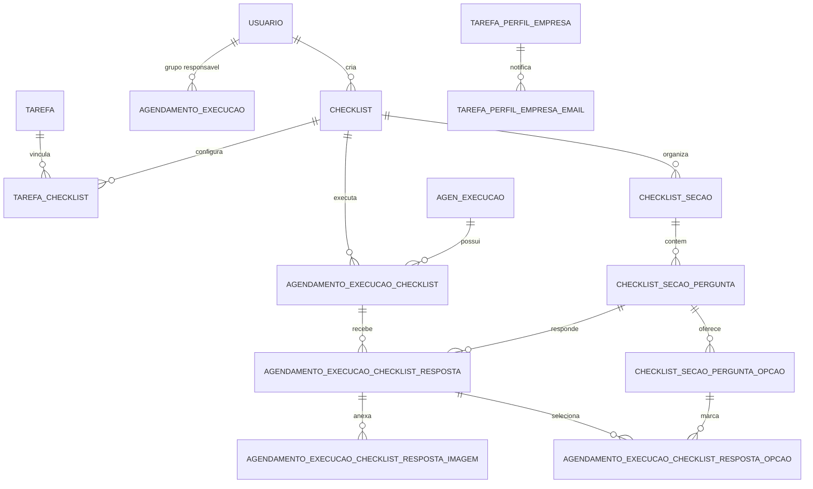

# Explicativo da solucao - CISS-181148 Checklist

## Objetivo

O script `CISS-181148 - CHECKLIST.sql` cria a estrutura de checklist vinculada a tarefas e execucoes de agendamento no schema `TAREFA`.

A solucao permite:

- Cadastrar checklists reutilizaveis.
- Vincular checklists a tarefas.
- Organizar cada checklist por secoes, perguntas e opcoes de resposta.
- Registrar a execucao de um checklist dentro de uma execucao de agendamento.
- Armazenar respostas, opcoes selecionadas e imagens anexadas.
- Informar e-mails vinculados ao perfil de empresa da tarefa.
- Associar um grupo de usuarios a `TAREFA.AGENDAMENTO_EXECUCAO`.

## Validacao aplicada

Foi identificada e corrigida uma inconsistencia de sintaxe:

- Removida a virgula excedente apos a constraint `FK_IDCHECKLIST` em `TAREFA.TAREFA_CHECKLIST`.

Tambem foi aplicada a indentacao padrao do repositorio:

- 4 espacos por nivel de indentacao.
- Colunas em linhas proprias.
- Alinhamento visual de nomes de colunas e tipos.
- Espaco entre nome da tabela referenciada e lista de colunas em FKs, por exemplo `DBA.USUARIO (IDUSUARIO)`.
- Preservacao dos nomes de tabelas, colunas, tipos, constraints e relacionamentos.

Observacao: o script manteve o formato original com constraints inline e terminadores `;`. O padrao geral do repositorio para DDL recomenda constraints em comandos `ALTER TABLE ... ADD CONSTRAINT`, separados por `GO`, mas essa alteracao estrutural nao foi aplicada para evitar mudar o escopo do script alem da validacao e formatacao solicitadas.

## DER

Arquivo Mermaid gerado: `DER_CISS-181148_CHECKLIST.mmd`.

## Dicionario das tabelas

### TAREFA.CHECKLIST

Cadastro principal do checklist.

| Coluna | Tipo | Obrigatorio | Papel |
| --- | --- | --- | --- |
| IDCHECKLIST | INTEGER IDENTITY | Sim | Chave primaria do checklist. |
| DSCHECKLIST | VARCHAR(100) | Nao | Descricao do checklist. |
| DHCRIACAO | TIMESTAMP | Sim | Data e hora de criacao. |
| DHALTERACAO | TIMESTAMP | Sim | Data e hora da ultima alteracao. |
| FGATIVO | SMALLINT | Sim | Indicador de checklist ativo. |
| IDUSUARIOCRIACAO | INTEGER | Sim | Usuario responsavel pela criacao. |

### TAREFA.TAREFA_CHECKLIST

Tabela associativa entre tarefa e checklist.

| Coluna | Tipo | Obrigatorio | Papel |
| --- | --- | --- | --- |
| IDTAREFACHECKLIST | INTEGER IDENTITY | Sim | Chave primaria do vinculo. |
| IDTAREFA | INTEGER | Sim | Tarefa vinculada. |
| IDCHECKLIST | INTEGER | Sim | Checklist vinculado. |

### TAREFA.AGENDAMENTO_EXECUCAO_CHECKLIST

Registro da execucao de um checklist dentro de uma execucao de agendamento.

| Coluna | Tipo | Obrigatorio | Papel |
| --- | --- | --- | --- |
| IDAGENDAMENTOEXECUCAOCHECKLIST | BIGINT IDENTITY | Sim | Chave primaria da execucao do checklist. |
| IDAGENDAMENTOEXECUCAO | INTEGER | Sim | Execucao de agendamento relacionada. |
| IDCHECKLIST | INTEGER | Sim | Checklist executado. |
| DHFINALIZACAO | TIMESTAMP | Sim | Data e hora de finalizacao. |
| DSPATHASSINATURA | VARCHAR(200) | Sim | Caminho da assinatura coletada. |

### TAREFA.CHECKLIST_SECAO

Cadastro das secoes de um checklist.

| Coluna | Tipo | Obrigatorio | Papel |
| --- | --- | --- | --- |
| IDCHECKLISTSECAO | INTEGER IDENTITY | Sim | Chave primaria da secao. |
| IDCHECKLIST | INTEGER | Sim | Checklist ao qual a secao pertence. |
| DSSECAO | VARCHAR(100) | Sim | Descricao da secao. |
| FGATIVO | SMALLINT | Sim | Indicador de secao ativa. |

### TAREFA.CHECKLIST_SECAO_PERGUNTA

Cadastro das perguntas de cada secao.

| Coluna | Tipo | Obrigatorio | Papel |
| --- | --- | --- | --- |
| IDCHECKLISTSECAOPERGUNTA | INTEGER IDENTITY | Sim | Chave primaria da pergunta. |
| IDCHECKLISTSECAO | INTEGER | Sim | Secao da pergunta. |
| DSPERGUNTA | VARCHAR(100) | Sim | Texto da pergunta. |
| TPTIPORESPOSTA | SMALLINT | Sim | Tipo de resposta esperado. |
| NRPESOPERGUNTA | SMALLINT | Sim | Peso da pergunta. |
| NRPONTOCORTE | SMALLINT | Nao | Ponto de corte para avaliacao. |
| FGEXIGEFOTO | SMALLINT | Sim | Indica se exige foto. |
| FGEXIGECOMENTARIO | SMALLINT | Sim | Indica se exige comentario. |
| FGATIVO | SMALLINT | Sim | Indicador de pergunta ativa. |

### TAREFA.CHECKLIST_SECAO_PERGUNTA_OPCAO

Opcoes possiveis para perguntas com resposta por selecao.

| Coluna | Tipo | Obrigatorio | Papel |
| --- | --- | --- | --- |
| IDCHECKLISTSECAOPERGUNTAOPCAO | INTEGER IDENTITY | Sim | Chave primaria da opcao. |
| IDCHECKLISTSECAOPERGUNTA | INTEGER | Sim | Pergunta relacionada. |
| DSOPCAO | VARCHAR(50) | Sim | Descricao da opcao. |
| FGNAOCONFORMIDADE | SMALLINT | Sim | Indica se a opcao representa nao conformidade. |

### TAREFA.AGENDAMENTO_EXECUCAO_CHECKLIST_RESPOSTA

Resposta registrada para uma pergunta em uma execucao de checklist.

| Coluna | Tipo | Obrigatorio | Papel |
| --- | --- | --- | --- |
| IDAGENDAMENTOEXECUCAOCHECKLISTRESPOSTA | BIGINT IDENTITY | Sim | Chave primaria da resposta. |
| IDAGENDAMENTOEXECUCAOCHECKLIST | BIGINT | Sim | Execucao de checklist relacionada. |
| IDCHECKLISTSECAOPERGUNTA | INTEGER | Sim | Pergunta respondida. |
| NRRESPOSTA | SMALLINT | Nao | Resposta numerica ou codificada. |
| DSRESPOSTA | VARCHAR(50) | Nao | Resposta textual curta. |
| DSCOMENTARIO | VARCHAR(100) | Nao | Comentario da resposta. |

### TAREFA.AGENDAMENTO_EXECUCAO_CHECKLIST_RESPOSTA_OPCAO

Opcoes selecionadas para uma resposta.

| Coluna | Tipo | Obrigatorio | Papel |
| --- | --- | --- | --- |
| IDAGENDAMENTOEXECUCAOCHECKLISTRESPOSTAOPCAO | BIGINT IDENTITY | Sim | Chave primaria da opcao selecionada. |
| IDAGENDAMENTOEXECUCAOCHECKLISTRESPOSTA | BIGINT | Sim | Resposta relacionada. |
| IDCHECKLISTSECAOPERGUNTAOPCAO | INTEGER | Sim | Opcao selecionada. |

### TAREFA.AGENDAMENTO_EXECUCAO_CHECKLIST_RESPOSTA_IMAGEM

Imagens anexadas a uma resposta.

| Coluna | Tipo | Obrigatorio | Papel |
| --- | --- | --- | --- |
| IDAGENDAMENTOEXECUCAOCHECKLISTRESPOSTAIMAGEM | BIGINT IDENTITY | Sim | Chave primaria da imagem. |
| IDAGENDAMENTOEXECUCAOCHECKLISTRESPOSTA | BIGINT | Sim | Resposta relacionada. |
| DSPATHIMAGEM | VARCHAR(200) | Sim | Caminho da imagem anexada. |

### TAREFA.TAREFA_PERFIL_EMPRESA_EMAIL

E-mails associados ao perfil de empresa da tarefa.

| Coluna | Tipo | Obrigatorio | Papel |
| --- | --- | --- | --- |
| IDTAREFAPERFILEMPRESAEMAIL | INTEGER IDENTITY | Sim | Chave primaria do e-mail. |
| IDTAREFAPERFILEMPRESA | INTEGER | Sim | Perfil de empresa relacionado. |
| DSEMAIL | VARCHAR(100) | Sim | Endereco de e-mail. |

## Alteracao em tabela existente

### TAREFA.AGENDAMENTO_EXECUCAO

Foi adicionada a coluna `IDUSUARIOGRUPO`, com FK para `DBA.USUARIO (IDUSUARIO)`.

Essa coluna permite relacionar a execucao de agendamento a um usuario ou grupo de usuarios responsavel pelo fluxo.

## Fluxo funcional

1. O usuario cria um checklist em `TAREFA.CHECKLIST`.
2. O checklist e associado a uma tarefa em `TAREFA.TAREFA_CHECKLIST`.
3. O checklist e estruturado em secoes, perguntas e opcoes.
4. Quando uma tarefa agendada e executada, o checklist aplicado e registrado em `TAREFA.AGENDAMENTO_EXECUCAO_CHECKLIST`.
5. Cada pergunta respondida gera registro em `TAREFA.AGENDAMENTO_EXECUCAO_CHECKLIST_RESPOSTA`.
6. Respostas de multipla escolha podem registrar opcoes em `TAREFA.AGENDAMENTO_EXECUCAO_CHECKLIST_RESPOSTA_OPCAO`.
7. Evidencias fotograficas ficam relacionadas a resposta em `TAREFA.AGENDAMENTO_EXECUCAO_CHECKLIST_RESPOSTA_IMAGEM`.

## Pontos de atencao

- Campos `FGATIVO`, `FGEXIGEFOTO`, `FGEXIGECOMENTARIO` e `FGNAOCONFORMIDADE` usam `SMALLINT`; se a regra de negocio for booleana, recomenda-se padronizar os valores aceitos em documentacao ou constraint.
- Campos de tipo como `TPTIPORESPOSTA` dependem de catalogo funcional externo ou documentacao complementar para indicar os codigos validos.
- A tabela `TAREFA.TAREFA_CHECKLIST` nao possui constraint de unicidade para evitar duplicidade do par `IDTAREFA`/`IDCHECKLIST`.
