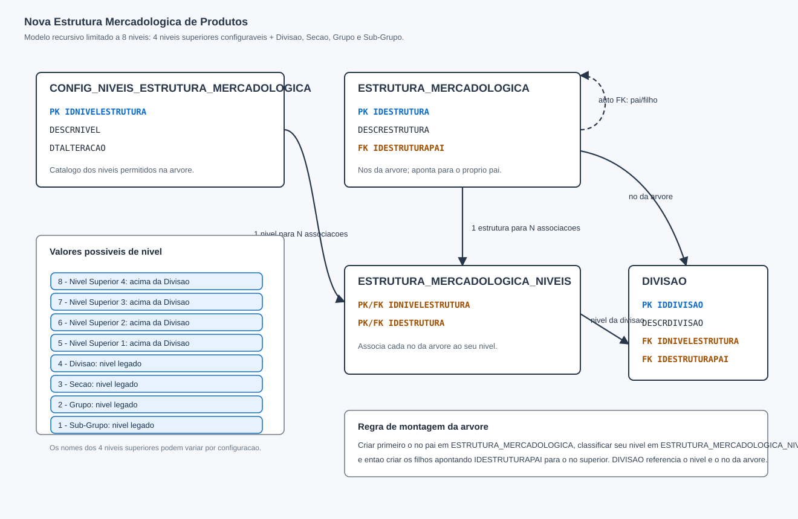

# Nova Estrutura Mercadologica Recursiva

## Objetivo

Este artigo documenta a nova funcionalidade de Estrutura Mercadologica de Produtos, criada para permitir uma categorizacao hierarquica mais flexivel do cadastro mercadologico. O modelo passa a permitir ate 8 niveis de classificacao, mantendo os 4 niveis historicos ja conhecidos pelo negocio e adicionando ate 4 niveis superiores acima de Divisao.

Os niveis historicos sao:

- Divisao
- Secao
- Grupo
- Sub-Grupo

Os novos niveis superiores sao configuraveis e ficam acima de Divisao. Eles permitem criar agrupamentos mais amplos, por exemplo Categoria, Departamento, Linha, Macrogrupo ou qualquer outra nomenclatura definida pelo cliente.

## DER da Solucao



## Visao Geral do Modelo

A solucao foi desenhada com uma tabela recursiva. Isso significa que a propria tabela de estrutura guarda os registros da arvore e tambem a relacao entre pai e filho.

Na pratica, um registro pode representar qualquer nivel da arvore. O que define se aquele registro e uma Divisao, Secao, Grupo, Sub-Grupo ou um nivel superior e a associacao feita na tabela de niveis.

O modelo e composto por tres novas tabelas principais:

- `DBA.CONFIG_NIVEIS_ESTRUTURA_MERCADOLOGICA`
- `DBA.ESTRUTURA_MERCADOLOGICA`
- `DBA.ESTRUTURA_MERCADOLOGICA_NIVEIS`

A tabela existente `DBA.DIVISAO` passa a se relacionar com esse novo modelo pelos campos `IDNIVELESTRUTURA` e `IDESTRUTURAPAI`.

## Tabela CONFIG_NIVEIS_ESTRUTURA_MERCADOLOGICA

Esta tabela configura quais niveis podem existir na arvore.

Campos:

| Campo | Funcao |
| --- | --- |
| `IDNIVELESTRUTURA` | Identificador do nivel. E a chave primaria da tabela. |
| `DESCRNIVEL` | Nome apresentado para o nivel, como Divisao, Categoria ou Nivel Superior. |
| `DTALTERACAO` | Data/hora da ultima alteracao do registro. |

Valores possiveis para o modelo completo:

| ID | Nivel | Origem | Observacao |
| --- | --- | --- | --- |
| 8 | Nivel Superior 4 | Novo | Nivel mais alto da arvore, quando utilizado. |
| 7 | Nivel Superior 3 | Novo | Nivel acima da Divisao. |
| 6 | Nivel Superior 2 | Novo | Nivel acima da Divisao. |
| 5 | Nivel Superior 1 | Novo | Nivel imediatamente acima da Divisao. |
| 4 | Divisao | Legado | Primeiro nivel historico da estrutura mercadologica. |
| 3 | Secao | Legado | Nivel abaixo de Divisao. |
| 2 | Grupo | Legado | Nivel abaixo de Secao. |
| 1 | Sub-Grupo | Legado | Nivel mais analitico legado. |

Observacao de QA: o banco possui a estrutura necessaria para cadastrar os niveis, mas a regra de limite maximo de 8 niveis deve ser validada pela aplicacao, rotina de carga ou regra de banco, conforme o desenho final da solucao.

## Tabela ESTRUTURA_MERCADOLOGICA

Esta tabela armazena os nos da arvore mercadologica.

Campos:

| Campo | Funcao |
| --- | --- |
| `IDESTRUTURA` | Identificador unico do no da arvore. |
| `DESCRESTRUTURA` | Descricao do no, por exemplo Categoria 1, Bebidas ou Alimentos. |
| `IDESTRUTURAPAI` | Aponta para o no pai dentro da propria tabela. Quando nulo, indica que o registro e raiz. |

Exemplo de arvore:

```text
Nivel Superior 2
  Nivel Superior 1
    Divisao
      Secao
        Grupo
          Sub-Grupo
```

Como a tabela e recursiva, todos esses registros ficam na mesma tabela. A hierarquia e montada pelo campo `IDESTRUTURAPAI`.

Exemplo:

| IDESTRUTURA | DESCRESTRUTURA | IDESTRUTURAPAI |
| --- | --- | --- |
| 100 | Varejo | NULL |
| 110 | Bebidas | 100 |
| 120 | Alcoolicas | 110 |
| 130 | Cervejas | 120 |
| 140 | Long Neck | 130 |

Nesse exemplo, `Varejo` e o no raiz. `Bebidas` e filho de `Varejo`. `Alcoolicas` e filho de `Bebidas`, e assim sucessivamente.

## Tabela ESTRUTURA_MERCADOLOGICA_NIVEIS

Esta tabela informa qual e o nivel de cada no da arvore.

Campos:

| Campo | Funcao |
| --- | --- |
| `IDNIVELESTRUTURA` | Nivel atribuido ao no. Referencia `CONFIG_NIVEIS_ESTRUTURA_MERCADOLOGICA`. |
| `IDESTRUTURA` | No da arvore. Referencia `ESTRUTURA_MERCADOLOGICA`. |

Exemplo:

| IDNIVELESTRUTURA | IDESTRUTURA | Interpretacao |
| --- | --- | --- |
| 6 | 100 | Varejo e um Nivel Superior 2. |
| 5 | 110 | Bebidas e um Nivel Superior 1. |
| 4 | 120 | Alcoolicas e uma Divisao. |
| 3 | 130 | Cervejas e uma Secao. |
| 2 | 140 | Long Neck e um Grupo. |

Regra de negocio recomendada: cada no da arvore deve possuir apenas um nivel. Caso contrario, o mesmo registro poderia ser interpretado como mais de uma camada da estrutura.

## Relacionamento com DBA.DIVISAO

A tabela `DBA.DIVISAO` continua existindo e passa a se conectar a nova estrutura por dois campos:

| Campo | Funcao |
| --- | --- |
| `IDNIVELESTRUTURA` | Indica em qual nivel da nova estrutura a divisao esta posicionada. |
| `IDESTRUTURAPAI` | Aponta para o no correspondente em `ESTRUTURA_MERCADOLOGICA`. |

O campo `IDNIVELESTRUTURA` informa o tipo de nivel. O campo `IDESTRUTURAPAI` informa o registro da arvore ao qual a divisao esta vinculada.

Exemplo de negocio:

```text
Nivel Superior: Superior 1
  Categoria: Categoria 1
    Divisao: ALIMENTOS
```

Neste caso, a divisao `ALIMENTOS` pode estar vinculada ao no `Categoria 1`, permitindo que a estrutura antiga seja posicionada abaixo dos novos niveis superiores.

## Como Gravar uma Nova Arvore

A gravacao deve seguir a ordem da hierarquia: primeiro o pai, depois os filhos.

1. Cadastrar o nivel em `CONFIG_NIVEIS_ESTRUTURA_MERCADOLOGICA`, caso ainda nao exista.
2. Cadastrar o no em `ESTRUTURA_MERCADOLOGICA`.
3. Classificar o no em `ESTRUTURA_MERCADOLOGICA_NIVEIS`.
4. Cadastrar os filhos apontando `IDESTRUTURAPAI` para o no pai.
5. Vincular `DBA.DIVISAO` ao nivel e ao no correto.

Exemplo tecnico:

```sql
insert into DBA.ESTRUTURA_MERCADOLOGICA
  (IDESTRUTURA, DESCRESTRUTURA, IDESTRUTURAPAI)
values
  (100, 'Superior 1', null);

insert into DBA.ESTRUTURA_MERCADOLOGICA_NIVEIS
  (IDNIVELESTRUTURA, IDESTRUTURA)
values
  (6, 100);

insert into DBA.ESTRUTURA_MERCADOLOGICA
  (IDESTRUTURA, DESCRESTRUTURA, IDESTRUTURAPAI)
values
  (110, 'Categoria 1', 100);

insert into DBA.ESTRUTURA_MERCADOLOGICA_NIVEIS
  (IDNIVELESTRUTURA, IDESTRUTURA)
values
  (5, 110);

update DBA.DIVISAO
set IDNIVELESTRUTURA = 5,
    IDESTRUTURAPAI = 110
where IDDIVISAO = 1;
```

## Regras de Negocio

- A estrutura deve permitir no maximo 8 niveis.
- Os niveis 1 a 4 representam a estrutura historica: Sub-Grupo, Grupo, Secao e Divisao.
- Os niveis 5 a 8 representam novas camadas acima de Divisao.
- Um no raiz deve ter `IDESTRUTURAPAI` nulo.
- Um no filho deve sempre apontar para um pai existente.
- A arvore deve ser gravada de cima para baixo.
- Uma Divisao pode estar vinculada a um no superior da arvore por `IDESTRUTURAPAI`.
- Divisoes com `IDNIVELESTRUTURA` preenchido e `IDESTRUTURAPAI` nulo indicam classificacao incompleta.
- A aplicacao deve impedir ciclos, como um registro apontar para si mesmo ou para um descendente.

## Pontos de Atencao para QA

Cenarios minimos de validacao:

| Cenario | Resultado esperado |
| --- | --- |
| Criar nivel acima de Divisao | Nivel deve ser salvo e ficar disponivel para associacao. |
| Criar no raiz | Registro deve ser salvo com `IDESTRUTURAPAI` nulo. |
| Criar no filho | Registro deve apontar para um pai existente. |
| Associar no a nivel | Registro deve ser criado em `ESTRUTURA_MERCADOLOGICA_NIVEIS`. |
| Vincular Divisao a estrutura | `DBA.DIVISAO.IDNIVELESTRUTURA` e `DBA.DIVISAO.IDESTRUTURAPAI` devem ser atualizados. |
| Tentar exceder 8 niveis | Operacao deve ser bloqueada. |
| Tentar criar ciclo recursivo | Operacao deve ser bloqueada. |
| Remover pai com filhos | Operacao deve ser bloqueada ou tratada conforme regra definida. |
| Divisao sem no pai | Sistema deve indicar classificacao pendente ou incompleta. |

## Resultado Esperado para o Usuario

Com a nova funcionalidade, o usuario consegue montar uma arvore mercadologica mais ampla que a estrutura antiga. Antes, a classificacao partia de Divisao, Secao, Grupo e Sub-Grupo. Agora, a empresa pode criar ate 4 niveis adicionais acima de Divisao, permitindo uma visao mais gerencial e flexivel da categorizacao dos produtos.

O ganho principal e permitir que a classificacao reflita melhor a organizacao comercial do cliente, sem abandonar a estrutura historica ja utilizada pelos produtos.
