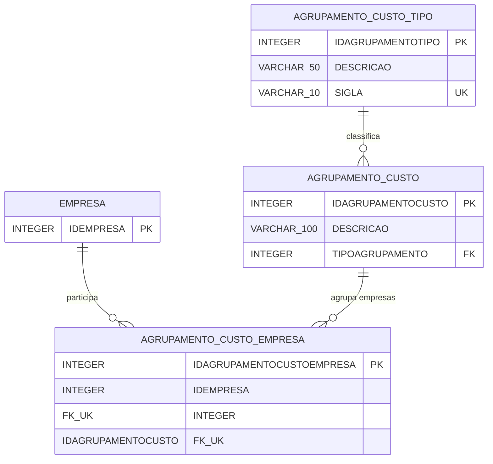

# Detalhamento das alteracoes - ObjetosCMC.sql

## Base de comparacao

Este levantamento compara a versao atual de `15_CMC/ObjetosCMC.sql` com a primeira versao disponivel no Git.

- Commit base: `2d3d47acba6d3c573b9729506736f76e8913999f`
- Arquivo no commit base: `15_CMC/ObjetosCMC_V1.sql`
- Observacao: no commit seguinte, `33817137a7ddc38041be17d79a02f0fcb0fe5722`, o mesmo conteudo foi renomeado para `15_CMC/ObjetosCMC.sql`.
- Tamanho da versao base: 372 linhas
- Tamanho da versao atual analisada: 728 linhas
- Arquivo gerado para nova tarefa de banco: `15_CMC/ObjetosCMC_v2.sql`, contendo apenas objetos novos e objetos alterados em relacao a versao base.

## DER das novas tabelas de agrupamento

## Dicionario das novas tabelas

### DBA.AGRUPAMENTO_CUSTO_TIPO

Tabela de dominio para identificar o tipo de agrupamento de custo.

| Coluna | Tipo | Obrigatorio | Papel |
| --- | --- | --- | --- |
| IDAGRUPAMENTOTIPO | INTEGER IDENTITY | Sim | Chave primaria da tabela. |
| DESCRICAO | VARCHAR(50) | Sim | Descricao do tipo de agrupamento. |
| SIGLA | VARCHAR(10) | Sim | Codigo curto do tipo, com constraint unica. Para CMC, foi criada a sigla `CMC`. |

Constraints:

- `PK_AGRUPAMENTO_CUSTO_TIPO`: chave primaria em `IDAGRUPAMENTOTIPO`.
- `UK_AGRUPAMENTO_CUSTO_TIPO_SIGLA`: unicidade da `SIGLA`.

### DBA.AGRUPAMENTO_CUSTO

Tabela de cadastro do agrupamento de custo.

| Coluna | Tipo | Obrigatorio | Papel |
| --- | --- | --- | --- |
| IDAGRUPAMENTOCUSTO | INTEGER IDENTITY | Sim | Chave primaria do agrupamento. |
| DESCRICAO | VARCHAR(100) | Sim | Descricao do agrupamento. |
| TIPOAGRUPAMENTO | INTEGER | Sim | Tipo do agrupamento, relacionado a `AGRUPAMENTO_CUSTO_TIPO`. |

Constraints:

- `PK_AGRUPAMENTO_CUSTO`: chave primaria em `IDAGRUPAMENTOCUSTO`.
- `FK_AGRUPAMENTO_CUSTO_TIPO`: FK de `TIPOAGRUPAMENTO` para `AGRUPAMENTO_CUSTO_TIPO.IDAGRUPAMENTOTIPO`.

### DBA.AGRUPAMENTO_CUSTO_EMPRESA

Tabela associativa que vincula empresas a um agrupamento de custo. No processamento CMC, ela define quais empresas devem compartilhar a base de calculo.

| Coluna | Tipo | Obrigatorio | Papel |
| --- | --- | --- | --- |
| IDAGRUPAMENTOCUSTOEMPRESA | INTEGER IDENTITY | Sim | Chave primaria do vinculo. |
| IDEMPRESA | INTEGER | Sim | Empresa participante do agrupamento, relacionada a `EMPRESA`. |
| IDAGRUPAMENTOCUSTO | INTEGER | Sim | Agrupamento de custo ao qual a empresa pertence. |

Constraints:

- `PK_AGRUPAMENTO_CUSTO_EMPRESA`: chave primaria em `IDAGRUPAMENTOCUSTOEMPRESA`.
- `FK_AGR_CUSTO_EMPRESA_AGRUP`: FK de `IDAGRUPAMENTOCUSTO` para `AGRUPAMENTO_CUSTO.IDAGRUPAMENTOCUSTO`.
- `FK_AGR_CUSTO_EMPRESA_EMPRESA`: FK de `IDEMPRESA` para `EMPRESA.IDEMPRESA`.
- `UK_AGR_CUSTO_EMPRESA`: impede duplicidade de empresa dentro do mesmo agrupamento.

## Objetos existentes na primeira versao

A primeira versao do arquivo ja continha:

- Tabelas de processamento: `CUSTO_MEDIO_COMPRA_PROCESSAMENTO`, `CUSTO_MEDIO_COMPRA_PROCHIST` e `CUSTO_MEDIO_COMPRA_CTRLTRIGGER`.
- Triggers de fila sobre `MOVIMENTO_CUSTO`: `TR_ATCMC_FILA_AI`, `TR_ATCMC_FILA_AU` e `TR_ATCMC_FILA_AD`.
- Function de calculo: `UF_CALCULADORA_CMC`.
- Procedure de processamento: `SP_PROCESSA_CUSTO_MEDIO_COMPRA_CMC`.

## Novos objetos incluidos

Foram adicionadas tres tabelas para parametrizar agrupamentos de custo:

- `AGRUPAMENTO_CUSTO_TIPO`
- `AGRUPAMENTO_CUSTO`
- `AGRUPAMENTO_CUSTO_EMPRESA`

Foram adicionadas tres functions para centralizar regras de negocio:

- `VALIDA_CTR_CMC`: centraliza a validacao que habilita o controle CMC por empresa ou configuracao geral.
- `UF_SALDOEST_DTPOSICAO_CMC`: centraliza a apuracao de saldo de estoque em uma data, considerando empresas do mesmo agrupamento CMC.
- `UF_TPOPERACAO_CMC`: centraliza a identificacao de operacao bonificada com base no tipo de operacao fiscal.

## Arquivo para versionamento

Foi criado o arquivo `ObjetosCMC_v2.sql` para uso em nova tarefa de banco.

O arquivo contem:

- Tabelas novas de agrupamento de custo e suas constraints.
- Inserts iniciais do tipo e agrupamento CMC.
- Function nova `VALIDA_CTR_CMC`.
- Triggers alteradas `TR_ATCMC_FILA_AI`, `TR_ATCMC_FILA_AU` e `TR_ATCMC_FILA_AD`.
- Functions novas `UF_SALDOEST_DTPOSICAO_CMC` e `UF_TPOPERACAO_CMC`.
- Function alterada `UF_CALCULADORA_CMC`.
- Procedure alterada `SP_PROCESSA_CUSTO_MEDIO_COMPRA_CMC`.

## Alteracoes estruturais nas tabelas de agrupamento

As novas tabelas foram padronizadas para seguir o formato das primeiras tabelas do arquivo:

- Drop das PK, FK e UK antes do `CREATE TABLE`.
- `CREATE TABLE` sem constraints inline.
- Criacao de cada constraint em comando `ALTER TABLE ... ADD CONSTRAINT` exclusivo logo abaixo do `CREATE TABLE`.
- Separacao de todos os comandos com `GO`, sem linha em branco entre os comandos.
- Inclusao da referencia formal entre `AGRUPAMENTO_CUSTO_EMPRESA.IDEMPRESA` e `EMPRESA.IDEMPRESA`.

Tambem foram incluidos inserts iniciais para:

- Criar o tipo de agrupamento `CMC`.
- Criar o agrupamento padrao `Agrupamento CMC`.
- Manter como comentario um exemplo de carga para `AGRUPAMENTO_CUSTO_EMPRESA`.

## Alteracoes nas triggers

As triggers `TR_ATCMC_FILA_AI`, `TR_ATCMC_FILA_AU` e `TR_ATCMC_FILA_AD` passaram a usar `DBA.VALIDA_CTR_CMC` no `WHEN`.

Antes, a regra de ativacao do controle CMC ficava espalhada nos objetos. Agora, a decisao de processar ou nao o CMC fica centralizada na function `VALIDA_CTR_CMC`, que verifica:

- Parametro por empresa em `CONFIG_ATRIBUTO_VALORES`, atributo `490`.
- Parametro geral em `CONFIG_ENTIDADE`, entidade `CTR`, chave `0/9`.

Tambem ha ajustes de comportamento para origens de movimento:

- Insercao considera `NFE`, `PRD`, `TRC` e `SIP` com desagregacao para zerar custo medio e quantidade de estoque de compra.
- Fila evita processamento para origens `TRC` e `MCC` em pontos especificos.
- Exclusao remove pendencia da fila quando nao existem movimentos posteriores e a pendencia ainda esta aberta.

## Alteracoes em functions existentes

### UF_CALCULADORA_CMC

A function foi ampliada em relacao a primeira versao.

Principais mudancas:

- Passou a consultar `UF_SALDOEST_DTPOSICAO_CMC` para obter saldo de estoque posicionado, considerando agrupamento de empresas quando houver parametrizacao.
- Passou a consultar `UF_TPOPERACAO_CMC` para identificar operacoes bonificadas.
- Incluiu tratamento para origens `SIP`, `PRD`, `TRC` e `MCC`.
- Incluiu regra envolvendo `DESAGREGACAO_MOVIMENTO_NOTAS`.
- A memoria de calculo foi mantida e expandida para refletir novas variaveis e decisoes do calculo.

Em termos de volume, o corpo da function passou de aproximadamente 142 linhas na versao base para 187 linhas na versao atual.

## Alteracoes em procedure existente

### SP_PROCESSA_CUSTO_MEDIO_COMPRA_CMC

A procedure foi ampliada para processar movimentos considerando agrupamento de empresas.

Principais mudancas:

- Incluiu CTE `EMPRESAS_AGRUPAMENTO`, baseada em `AGRUPAMENTO_CUSTO_TIPO`, `AGRUPAMENTO_CUSTO` e `AGRUPAMENTO_CUSTO_EMPRESA`.
- Quando a empresa da fila pertence a um agrupamento CMC, o processamento busca movimentos das demais empresas do grupo.
- Quando nao ha parametrizacao de agrupamento para a empresa, o processamento preserva o comportamento individual, usando a propria empresa da fila.
- Passou a considerar movimentos `SIP` vinculados a `DESAGREGACAO_MOVIMENTO_NOTAS`.
- Manteve o uso da tabela `CUSTO_MEDIO_COMPRA_CTRLTRIGGER` para bloquear realimentacao da fila durante o processamento.
- Manteve a gravacao de historico em `CUSTO_MEDIO_COMPRA_PROCHIST`.
- Incluiu atualizacao relacionada a movimentos `TRC` e manteve tratamento especifico de origem `MCC`.

Em termos de volume, o corpo da procedure passou de aproximadamente 109 linhas na versao base para 185 linhas na versao atual.

## Impacto funcional resumido

As alteracoes transformam o processamento CMC de um fluxo isolado por empresa para um fluxo parametrizavel por agrupamento de empresas.

Com isso:

- A habilitacao do CMC fica centralizada em uma function.
- O saldo base do calculo pode considerar empresas agrupadas.
- A procedure de reprocessamento pode recalcular movimentos posteriores em todas as empresas vinculadas ao mesmo agrupamento CMC.
- As regras de tipo de operacao e bonificacao deixam de ficar acopladas diretamente ao calculo principal.
- O script fica mais aderente ao padrao de criacao de constraints adotado no repositorio.
